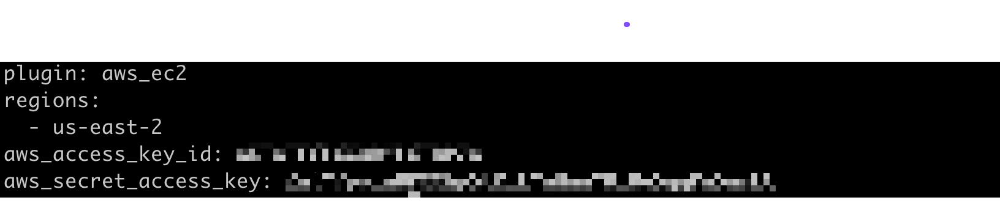
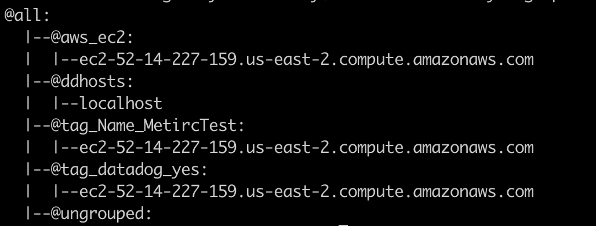

## Automated Datadog agent install across multiple hosts via Ansible

### Intended Audience
This document has been created for a person reality new to using Ansible.  A more notice/expert Ansible user can still use the content provided to get a multihost Datadog agent install playbook working in a very short period of time.   Any questions/suggestions about the content of this document please feel free to reach out to ryan.hennessy@datadoghq.com

### Introduction
This document details the steps needed to install the Datadog agent across multiple hosts in your environment.  This is in no way a fully exhaustive step by step process in order to learn Ansible.   If further information is needed on any of these topics it is suggested that you review the Ansible documentation located at [docs.ansible.com](http://docs.ansible.com).  

Before continuing please make sure that the following items are in place:
* You have a host that can ssh to all the servers you would like the Datadog agent to be installed on.
* You have credentials (password or ssh key) to login to each of the hosts
* The user that is used to login to these hosts has the ability to escalate privileges to root. (ie sudo)
* You have the latest version of Ansible installed on the host that will be connecting to all the servers.
  * Ansible install guide can be found [here](https://docs.ansible.com/ansible/latest/installation_guide/intro_installation.html)
* A user setup in the IAM section of AWS with an access and secret key pair to interact with the AWS API.

### Verify Initial Configuration
You will need to make sure that you have a default Ansible configuration file in place.  The configuration file will be located at **/etc/ansible/ansible.cfg**.   Depending on how you decided to install the Ansible binaries this file might not be there.  If that is the case you can get a copy of default configuration file [here](https://raw.githubusercontent.com/ansible/ansible/devel/examples/ansible.cfg).

### Ansible Inventory file(s)
One of the main components that is needed by Ansible is a valid inventory file(s). These files can either be static or dynamic.   A static inventory file is a .ini formatted list of hosts, groups, and variables.  We will not being using a static inventory in this document but you can read more about the configuration of these types of files in the Ansible documentation.  

The inventory setup that this document is configuring is a Ansible AWS dynamic inventory.  Using this type of setup is beneficial because it will query the AWS API, to get the most up to date lists of virtual machines, each and every time you run this Datadog install playbook.   

By default the Ansible binaries look for the inventory file(s) at **/etc/ansible/hosts**.  You can override this behavior on the command line or in the Ansible configuration file.  This document will use the default location for the inventory file(s).   It is suggested that your remove the default file located at **/etc/ansible/hosts**. and in its place create a directory names **hosts**.   By doing this you can place multiple inventory files (both static and dynamic) in that directory.  Ansible concatenate all these file into a single running inventory.   

In this document, we will be configuring a dynamic inventory for a single availability zone in AWS.   The Ansible documentation details out how to do this same process for other public/private cloud environments.

In the newly created directory of **/etc/ansible/hosts** we will be creating a dynamic inventory for our AWS setup.  You can name the file anything that makes sense to you but make sure it has the .yaml extension.  Below is an example of this configuration file.   In order to make this unique for your environment change out the values for **regions, aws_access_key_id,** and **aws_secret_access_key**.  With any yaml file, spacing is important so please make sure that all indents are correctly spaced out.

#### Example Dynamic Configuration File


After the configuration is in place you can test the configuration by running the **ansible-inventory** command.  This command queries all the known inventory files and lists out a formatted graph of the host inventory.   If you run the following command you should see similar output if the configuration is correct.   

#### Inventory Command

ansible-inventory --graph


#### Example ansible-inventory output


### Ansible configuration for Datadog agent
To make the agent installation/configuration as simple as possible with Ansible, Datadog provides an Ansible role for this process.  The role has all configuration to follow best practices for the installation of the Datadog agent.   To install this role you will need to run the following command.  It will install the role files into the $HOME/.ansible/role directory on the Ansible host.   There is no need to modify these files but the location is mentioned for educational purposes.

#### Datadog Role installation
ansible-galaxy install Datadog.datadog


### Creating the Installation Ansible Playbook
The final step in all of this process is to create the Ansible playbook that uses the dynamic inventory and Datadog role.   The playbook needs run against a group of hosts in the dynamic inventory.  If you look back at the example output above you can see that the example EC2 VM is placed under a couple different group headings.   The group the following playbook chooses to use is the **tag_datadog_yes** group.   This group was created by Ansible because the host was tagged in EC2 with a tag called **datadog** and the value was set to **yes**.   By just adding this tag in EC2, and using the created Ansible group, we can control which hosts the Datadog agent gets installed on.   There is no need then to modify your playbook after the initial configuration.   You can re-run this playbook over and over again and it will continue validate that all hosts tagged with **datadog=yes** have the agent installed and configured.  Please feel free to use your own tag naming schema.  You will need to modify the value for **hosts** in the example Ansible playbook below.

The playbook also has a grouping called **datadog_config**. Under this heading you can place the content that you want to be in /etc/datadog-agent/datadog.yaml

The example playbook also uses the centos user to login.  Verify that you have the correct user for your VM image and that you also have the correct setup with the shared ssh keys.

**Warning**: Make sure if copying this example file that you validate the spacing stays consistent afterwards.   

#### Example Datadog Installation Playbook
```yaml
---
- name: Install Datadog Agent on servers in AWS
  hosts: tag_datadog_yes
  become: yes
  user: centos  
  roles:
    - { role: Datadog.datadog, become: yes }
  vars:
    datadog_api_key: asdfasdfj;kljas;dkfj;laksjdf;d
    datadog_config:
      tags:
        - myawstag
        - env:nonprod
        - pleaseworkansible
      logs_enabled: true
      process_config:
        enabled: "true"
...
```

#### Parts of the Ansible Playboook Explained
```yaml
  hosts: tag_datadog_yes
```
This is the group we chose to use to determine which hosts the Datadog agent will get installed.   This group is created by the dynamic inventory script because we tagged the host(s) with **datadog=yes** in EC2.


```yaml
  become: yes
  user: centos
```
This tells Ansible to first login to the system(s) as the centos user and then "sudo" over to root for the rest of the steps.  Make sure to modify the user value to match with whatever user is created for your image.  Also validate that the host running the Ansible playbook has the shared public key in order to login.

```yaml
  datadog_api_key: asdfasdfj;kljas;dkfj;laksjdf;d
```

You **will** need to modify this value to include a valid api key for your Datadog account.

```yaml
datadog_config:
  tags:
    - myawstag
    - env:nonprod
    - pleaseworkansible
  logs_enabled: true
  process_config:
    enabled: "true"
```

This section sets up the content you want in /etc/datadog/datadog-agent/datadog.yaml file.  The content under **datadog_config** is exactly what will be in that file and nothing else.   So if you need to configure any parameter that is not the default Datadog behavior it needs to be in this section.

### Running the Ansible Playbook
Once you have all the correct parameters in the playbook file you need to run it.   Execute the following command at a command prompt.  This same command can be run over and over again.   Ansible will only change/update the hosts that don't match what the playbook suggested state.

```
ansible-playboook <<your filename>>.yaml
```
